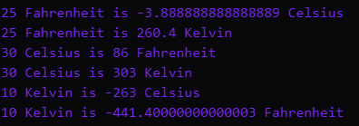

## Blogs

A JavaScript Temperature converter

```
let fahrenHeit = 25
let celsIus = 30
let kelVin = 10

celToFahr = ((celsIus) * 9 / 5 + 32)
celToKel = (celsIus + 273)
fahToCel = ((fahrenHeit - 32) * 5 / 9)
fahToKel = (9 / 5 * (fahrenHeit - 32) + 273)
kelToCel = (kelVin - 273)
kelToFahr = (9 / 5 * (kelVin - 273) + 32)

if (fahToCel !== 100) {
    console.log(`25 Fahrenheit is ${fahToCel} Celsius`)
}

if (fahToKel !== 80) {
    console.log(`25 Fahrenheit is ${fahToKel} Kelvin`)
}

if (celToFahr !== 40) {
    console.log(`30 Celsius is ${celToFahr} Fahrenheit`)
}

if (celToKel !== 500) {
    console.log(`30 Celsius is ${celToKel} Kelvin`)
}

if (kelToCel !== 30) {
    console.log(`10 Kelvin is ${kelToCel} Celsius`)
}

if (kelToFahr !== 10) {
    console.log(`10 Kelvin is ${kelToFahr} Fahrenheit`)
}
```


